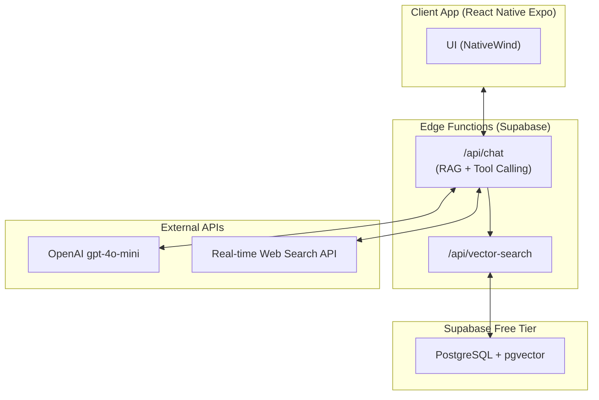
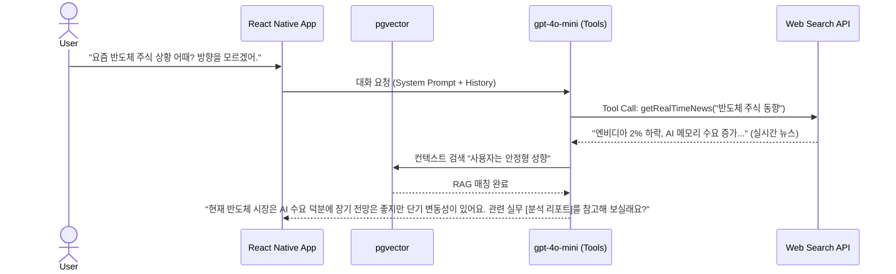

# Software Requirements Specification (SRS) - Vesper AI Companion OS

**Document ID:** SRS-002
**Revision:** 2.4 (Real-time Web Grounding Integration)
**Date:** 2026-04-18
**Standard:** ISO/IEC/IEEE 29148:2018 기반 확장

| 항목 | 내용 |
|---|---|
| **프로젝트명** | Action-Master AI Companion OS 'Vesper' (초기 클로즈드 베타 MVP) |
| **기반 문서** | PRD v1.0, Value Proposition 통합 |
| **작성 기준** | ISO/IEC/IEEE 29148:2018 및 Vibe Coding 최적화 포맷 |
| **타겟 및 예산** | MAU 50명 이하 / 월 고정비 0원, 총 예산 5만 원 미만 통제 |
| **Owner** | Vesper Product Team |

---

## 1. Introduction

### 1.1 Purpose
본 SRS는 투자 및 성장의 여정에서 사용자가 겪는 불안감을 해소하고 실질적인 목표 달성을 지원하는 **Action-Master AI Companion OS 'Vesper'**의 소프트웨어 요구사항을 정의한다. 

단순한 위로용 챗봇을 넘어, 본 시스템은 **'무한 페르소나 및 일상 교감'**, 대화 기록을 벡터로 저장하여 진화하는 **'진화하는 지능 (Heritage)'**, 그리고 **실시간 웹데이터(뉴스, 시장 지표)를 검색하여 최신 실전 투자 정보와 프리미엄 자료를 큐레이션하는 '실무적 성과 창출 (Growth Coach Nudge)'**이라는 핵심 가치를 제공한다. 본 문서는 '바이브 코딩 초보자'가 프롬프트 기반으로 즉각 구현할 수 있도록 아키텍처 및 DB 스키마를 확정하고, 초기 MVP 운영 예산을 5만 원 미만으로 극강 통제하는 기술적 명세를 포함한다. (화면 통제나 억압적 UI는 전면 배제)

### 1.2 Scope

#### 1.2.1 In-Scope (MVP)
| # | 범위 항목 | 설명 |
|---|---|---|
| IS-1 | 무한 페르소나 | 사용자 맞춤형 아바타 및 톤앤매너 설정 |
| IS-2 | 진화하는 지능 & RAG | 대화 기록의 pgvector 임베딩 및 맞춤형 응답 주입 |
| IS-3 | 실시간 웹데이터 검색 (Web Grounding) | LLM 툴 호출(Tool Calling)을 활용한 실시간 시장 뉴스 및 실전 정보 검색 연동 |
| IS-4 | B2B 교육/실무 큐레이션 | 실시간 웹 검색 결과와 매칭되는 실전 정보, 교육 링크 대화형 제안 |
| IS-5 | 옴니채널 일상 교감 | Push 알림(FCM) 기반 선톡 발송 |
| IS-6 | 시스템 아키텍처 | React Native(Expo) + Supabase + Vercel AI SDK 서버리스 구축 |

#### 1.2.2 Out-of-Scope (명시적 배제)
| # | 배제 항목 | 배제 사유 |
|---|---|---|
| OS-1 | 사용자 자산 직접 운용 | 자본시장법 위반 리스크, MVP 범위 초과 |
| OS-2 | 강압적 화면/행동 통제 | 화면 블러링, 버튼 잠금 등 억압적 UX 기능 절대 금지 |

#### 1.2.3 Constraints (제약사항)
| ID | 제약사항 | 유형 | 근거 |
|---|---|---|---|
| CON-1 | 1회 대화 생성 당 LLM 토큰 비용은 1.5원 미만을 유지해야 한다. | 비용/AI | MVP 예산 통제 요건 |
| CON-2 | 서버 인프라 및 DB 고정비는 0원(Zero)으로 수렴해야 한다. | 비용/인프라 | 5만 원 미만 예산 요건 |
| CON-3 | 투자 자문법 위반 소지가 있는 단어("무조건 매수", "수익률 보장")는 차단한다. | 법률/규제 | 컴플라이언스 필수 요건 |

#### 1.2.4 Assumptions (가정)
| ID | 가정 내용 | 검증 방안 |
|---|---|---|
| ASM-1 | 실시간 검색 API(Tavily 등)를 통한 정보 수집이 2초 이내에 완료될 것이다. | 엣지 함수 내 응답 지연 시간 프로파일링 |

#### 1.2.5 Contingency Plans (비상 대응 계획)
*   **CP-1. 예산 초과 위험 및 외부 검색 API 장애 시:** 실시간 웹 검색 도구의 타임아웃 발생 시, 검색을 생략하고 로컬 위로 템플릿 반환. 예산 80% 소진 시 '핵심 요약 모드' 및 외부 검색 기능 비활성화 스위칭.

---

## 2. Stakeholders

| 역할 (Role) | 대표 페르소나 | 책임 / 관심사 (Interest) |
|---|---|---|
| **안정형 직장인/가장** | Q2 Core | 정서적 지지 기반의 안정적 성장. 외로움 해소. |
| **N잡러 / 준전문가** | Adjacent | **최신 시장 트렌드, 실시간 뉴스 기반의 실전 정보와 네트워킹 큐레이션** 강력 요구. |
| **트라우마 고관여 유저** | Extreme | 과거 트라우마 극복을 위한 객관적이고 최신의 시장 정보 제공 요구. |

---

## 3. System Context and Interfaces

### 3.1 External Systems
| # | 외부 시스템 | 유형 | 역할 |
|---|---|---|---|
| EXT-01 | Supabase (Free) | BaaS | PostgreSQL, pgvector(RAG DB), 인증 |
| EXT-02 | OpenAI | API | 대화 생성 (`gpt-4o-mini`) |
| EXT-03 | Tavily API (또는 Finnhub News) | API | 실시간 시장 이슈 및 뉴스 데이터 검색 |

### 3.2 Component Diagram & Vibe Coding Stack

### 3.3 Interaction Sequences

#### 3.3.1 실시간 웹데이터 기반 실전 정보 제공 대화 (Tool Calling)

---

## 4. Specific Requirements

### 4.1 Functional Requirements

| ID | 요구사항 | Priority | Acceptance Criteria (Given/When/Then) |
|---|---|---|---|
| **REQ-F-01** | 페르소나 빌더 | M | 온보딩 진입 시 톤앤매너 저장 시 DB에 매핑된다. |
| **REQ-F-02** | Heritage 저장 | M | 대화 직후 텍스트가 임베딩되어 벡터 저장된다. |
| **REQ-F-03** | 실시간 뉴스 웹 검색 (Tool Calling) | M | **Given** 사용자가 최신 시장/경제 정보를 물었을 때 **When** LLM이 동작하면 **Then** Vercel AI SDK의 Tool 기능을 사용하여 외부 웹 검색 API(Tavily 등)를 호출하여 실시간 데이터를 확보한다. |
| **REQ-F-04** | 실전 투자/교육 자료 큐레이션 | M | **Given** 실시간 검색이 완료되면 **When** LLM이 응답할 때 **Then** 최신 뉴스를 바탕으로 한 실전 분석과 함께 외부 프리미엄 실무 자료(B2B) 링크를 자연스럽게 제안한다. |
| **REQ-F-05** | 옴니채널 일상 교감 | S | 24h 미접속 시 FCM 알림 발송. |

### 4.2 Non-Functional Requirements (Cost, Security)

| ID | 카테고리 | 측정 지표 및 기준 |
|---|---|---|
| **REQ-NF-01** | Compliance | Nudge 링크 포함 시에도 "수익 보장" 등 불법 단어는 정규식으로 마스킹. |
| **REQ-NF-02** | Performance | 실시간 검색(Tool Call)을 포함한 LLM 응답이 3초 이내에 스트리밍되기 시작해야 함. |
| **REQ-NF-03** | Cost | 예산 5만 원 미만 방어. 예산 80% 소진 시 실시간 검색 기능을 끄고 단답 모드 전환. |

---

## 5. Traceability Matrix

| Feature (PRD) | Requirement ID | Test Scenario |
|---|---|---|
| 페르소나 및 Heritage | REQ-F-01, 02 | RAG Recall 정확도 테스트 |
| **실시간 웹 기반 실전 정보 제공** | REQ-F-03, 04 | 대화 중 최신 뉴스 정상 호출 및 교육 링크(B2B) 클릭률 실측 |
| 일상 교감 및 방어 로직 | REQ-F-05, REQ-NF-03 | 비용 한도 도달 시 Tool Call(검색) 자동 비활성화 스위칭 테스트 |
