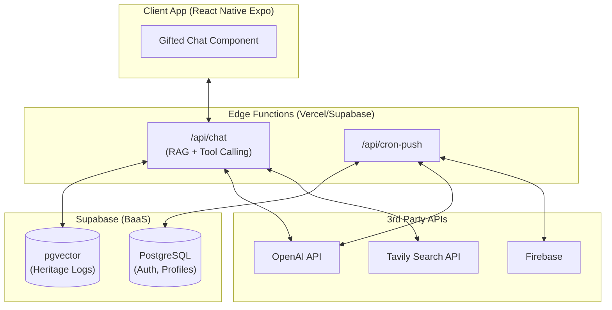
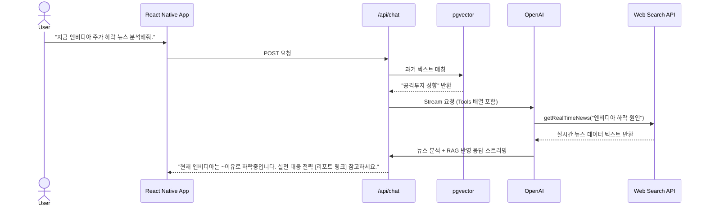

# Software Requirements Specification (SRS) - Vesper AI Companion OS
**[Human Developer & QA Version - Enterprise Rigor]**

**Document ID:** SRS-004-HUMAN
**Revision:** 4.3 (Real-time Web Grounding Integration)
**Date:** 2026-04-18
**Standard:** ISO/IEC/IEEE 29148:2018 기반 Vesper Custom

| 항목 | 내용 |
|---|---|
| **프로젝트명** | Action-Master AI Companion OS 'Vesper' (초기 클로즈드 베타 MVP) |
| **작성 목적** | 인간 개발자(FE/BE) 및 QA 엔지니어를 위한 무결점 요구사항 매트릭스 |
| **타겟 및 예산** | MAU 50명 이하 / 월 고정비 0원, 총 예산 5만 원 미만 통제 |

---

## 1. Introduction

### 1.1 Purpose
본 SRS는 투자 및 성장의 여정에서 사용자가 겪는 불안감을 해소하고 목표 달성을 지원하는 **'Vesper'**의 소프트웨어 요구사항을 정의한다.
단순 위로가 아닌 실무적 성과 창출을 위해, **실시간 웹 검색 API를 연동하여 최신 뉴스 기반의 실전 정보를 제공(Web Grounding)**하며 자연스러운 대화 맥락 속에서 프리미엄 B2B 자료를 큐레이션하는 고도화된 기능 스펙을 포함한다. (화면 통제 등 억압적 로직 전면 배제)

### 1.2 Scope

#### 1.2.1 In-Scope (MVP Phase 1)
1. **사용자 온보딩 및 인증:** 이메일 로그인, 2단계 페르소나 설정.
2. **진화하는 지능 (RAG):** 사용자 대화 로그의 `pgvector` 임베딩 및 유사도 기반 컨텍스트 주입.
3. **실시간 웹 기반 실전 정보 제공 (Tool Calling):** 최신 시장 동향 질문 시, LLM이 외부 검색 API(Tavily 등)를 실시간으로 호출하여 사실(Fact) 기반의 분석 정보 제공.
4. **실무 성과 창출 큐레이션:** 검색된 실전 정보를 바탕으로 프리미엄 자료 및 네트워킹(B2B 제휴) URL을 마크다운 링크로 제안.
5. **옴니채널 일상 교감 (FCM Push):** 24시간 미접속자 대상 푸시 알림 발송.

#### 1.2.2 Contingency Plans (비상 대응 계획)
| ID | 위기 상황 | 감지 조건 (Trigger) | Fallback Action (대응 로직) |
|---|---|---|---|
| CP-1 | 외부 웹 검색 API 장애 | Search API 응답 지연 > 1500ms | 툴 호출을 건너뛰고 내부 지식망 및 RAG만으로 응답 렌더링. |
| CP-2 | LLM API 과부하 | Vercel AI SDK 응답 지연 > 2500ms | 통신을 강제 종료하고 로컬 내장 위로 템플릿 반환. |

---

## 2. System Context and External Interfaces

### 2.1 Component Architecture

### 2.2 실시간 웹 검색 및 큐레이션 시퀀스 (Tool Calling Flow)

---

## 3. Detailed Requirement Specifications

### 3.1 Functional Requirements (기능 요구사항)

| ID | 카테고리 | 요구사항 명세 | Priority | Acceptance Criteria (QA) |
|---|---|---|---|---|
| **FR-001** | Profile | 페르소나 설정 및 생성 | P1 | 이름/말투 제출 시 DB `profiles`에 저장. |
| **FR-002** | RAG | 코사인 유사도 검색 | P1 | 채팅 요청 시 유사도 0.7 이상 상위 3개 레코드 반환. |
| **FR-003** | Web | 실시간 뉴스 웹 검색 (Tool Calling) | P1 | **Given** 유저가 최신 시장/경제 트렌드를 물을 때 **When** LLM이 동작하면 **Then** 외부 Search API를 호출하여 검색 결과 원문을 가져온다. |
| **FR-004** | Edu/B2B | 실전 교육/자료 대화형 큐레이션 | P1 | **Given** 실시간 뉴스를 분석한 후 **When** LLM이 응답할 때 **Then** 사용자 맥락에 부합하는 프리미엄 실전 자료(B2B 링크)를 마크다운으로 삽입한다. |
| **FR-005** | Chat | SSE 스트리밍 렌더링 | P1 | 툴 호출 후 최종 응답 수신 시 타이핑 효과로 렌더링. |
| **FR-006** | Push | 미접속자 FCM 선톡 발송 | P2 | 24시간 미접속자에게 Cron Job으로 푸시 발송. |

### 3.2 Non-Functional Requirements (비기능 요구사항)

| ID | 범주 | 세부 명세 | QA 검증 기준 |
|---|---|---|---|
| **NFR-001** | Performance | 검색 지연 보장 | 툴 콜링(Web Search)이 발생하더라도 첫 응답 스트리밍이 3초 이내에 시작되어야 한다. |
| **NFR-002** | Compliance| 투자 자문 규제 단어 마스킹 | 응답 내 정규식 `/(무조건 매수\|수익률 보장)/g` 매칭 시 마스킹. |
| **NFR-003** | Cost | 예산 5만 원 한도 방어 | 월 예산 임계치 도달 시, 무거운 'Tool Calling' 기능을 즉각 비활성화한다. |

---

## 4. Validation Plan & A/B Testing (MVP 검증 로직)

클로즈드 베타 50명을 대상으로 실험한다.

| 가설 (Hypothesis) | 측정 KPI (Mixpanel) | 성공 기준 (Success Criteria) |
|---|---|---|
| **H1. 실시간 정보 신뢰도:** 실시간 웹 데이터가 반영된 대화는 높은 링크 클릭률을 유도한다. | `b2b_chat_link_rendered` → `b2b_chat_link_clicked` (클릭 전환율 CTR) | 노출 대비 **클릭률(CTR) ≥ 8%** |
| **H2. 비용 안정성:** 외부 Search API(Tool Call) 연동에도 5만 원 예산 통제가 가능하다. | 1인당 API 호출 비용 환산 | **1인당 월 서버 지출 비용 ≤ 1,000 KRW** |

---
**[문서 끝 - SRS-004-HUMAN v4.3]**
