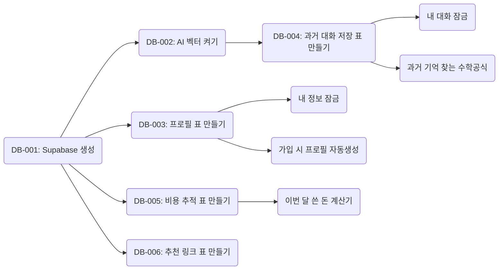
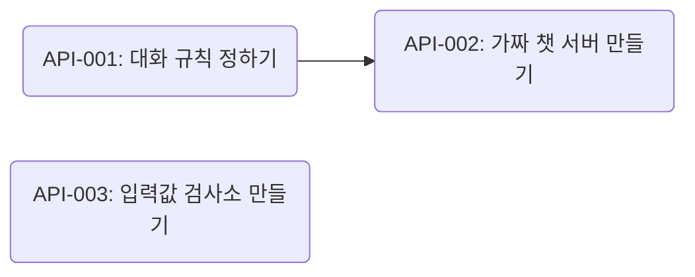
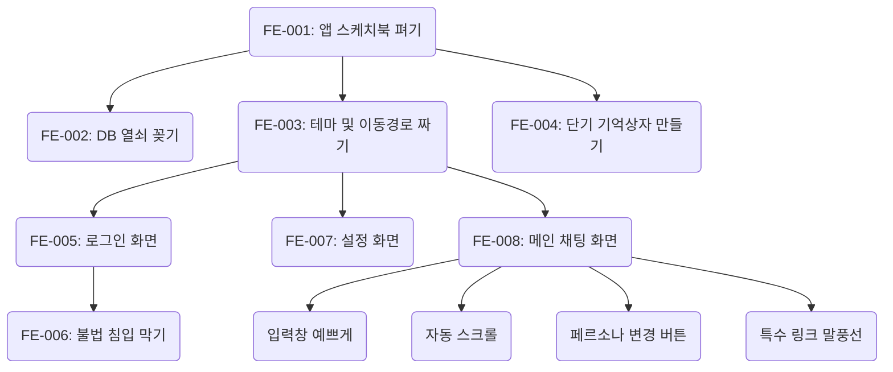
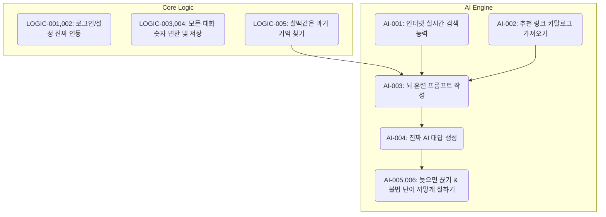
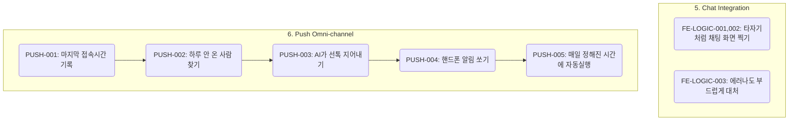
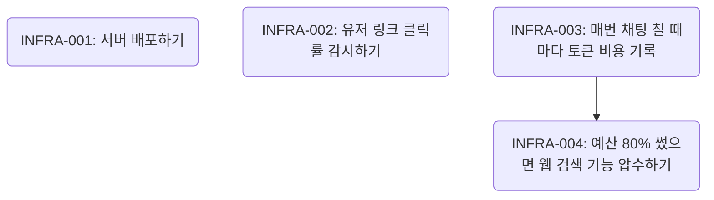

# Vesper AI - 바이브 코딩 초보자를 위한 상세 Task 통합 가이드

이 문서는 복잡한 개발 용어를 걷어내고, **"AI 코딩 에이전트(Cursor, Windsurf 등)에게 정확히 무엇을, 어떤 순서로 해달라고 프롬프트를 쳐야 하는지"**를 초보자의 눈높이에 맞춰 완벽하게 번역한 궁극의 마스터 가이드입니다. 

---

## 💎 0. 기획 철학(Value Proposition) 매핑 가이드
에이전트에게 지시를 내릴 때, 이 기능이 왜 필요한지(Why) 기획 철학을 함께 입력하면 환각이 줄어들고 코드의 퀄리티가 비약적으로 상승합니다.
1. **무한 페르소나 & 옴니채널:** `FE-007(페르소나 셋업)`, `PUSH-001~005(FCM 선톡)` 개발 시 **"이건 단순한 앱이 아니라 평생의 친구를 만드는 기능이야"**라고 강조하세요.
2. **진화하는 지능:** `LOGIC-003~005(양방향 RAG 저장)` 개발 시 **"나이를 먹듯 유저의 패턴을 학습해서 진화해야 해"**라고 강조하세요.
3. **실무적 성과 창출:** `AI-001(웹검색)`, `AI-002(B2B 카탈로그)` 개발 시 **"단순 위로가 아니라 즉각 실행 가능한 실무적 솔루션과 수익(BM)을 내야 해"**라고 강조하세요.
4. **초밀착 인지 동행:** UI 개발 전반에 걸쳐 **"화면 블러링 같은 억압적 통제는 절대 불가해"**라고 철학을 주입하세요.

---

## 🗺️ 1. 전체 도메인 통합 아키텍처 (The Big Picture)

우리가 만들 앱의 7가지 큰 조각(도메인)이 어떻게 연결되어 하나의 시스템으로 완성되는지 보여주는 전체 조감도입니다.

```mermaid
flowchart TD
    subgraph Phase1 [1. 데이터 & 약속 (Infra/DB, API Contract)]
        direction LR
        DB[(Supabase DB\n데이터 저장소)] <--> API[API 설계 및 Zod\n데이터 검증소]
    end
    
    subgraph Phase2 [2. 앱 화면 껍데기 (Frontend UI)]
        UI[React Native 화면 퍼블리싱]
    end
    
    subgraph Phase3 [3. 앱 로직 & AI 지능 (Core Logic & AI Engine)]
        direction LR
        FELogic[채팅 화면과 서버 연결] <--> AIEngine[AI 프롬프트 & 실시간 뉴스 검색]
        AIEngine <--> RAG[과거 대화 기억해내기]
    end
    
    subgraph Phase4 [4. 유저 관리 & 배포 (Omni-Channel & Infra)]
        Push[미접속자 먼저 말걸기 알림]
        Infra[비용 차단기 및 최종 앱 배포]
    end
    
    Phase1 -->|데이터베이스/규칙 준비 완료| Phase2
    Phase2 -->|예쁜 화면 위에 생명 불어넣기| Phase3
    Phase3 -->|똑똑한 AI 두뇌 완성 후| Phase4
    
    style Phase1 fill:#e1f5fe,stroke:#0288d1
    style Phase2 fill:#fff3e0,stroke:#f57c00
    style Phase3 fill:#e8f5e9,stroke:#388e3c
    style Phase4 fill:#f3e5f5,stroke:#7b1fa2
```

---

## 🛠️ 2. 도메인별 세부 Task 가이드 & 상관관계

### 🗄️ Domain 1. Infra & DB (데이터베이스 뼈대 세우기)
모든 것의 기초 공사입니다. 유저의 정보, 대화, 그리고 돈(비용)을 저장할 '엑셀 표(DB 테이블)'들을 만듭니다.



| Task ID | 선행 작업 | 바이브 코딩용 아주 쉬운 설명 (AI에게 이렇게 지시하세요) |
|:---|:---|:---|
| `DB-001` | 없음 | "Supabase에 접속해서 고정비 0원짜리 무료 프로젝트를 세팅해줘. (우리의 메인 서버야)" |
| `DB-002` | `DB-001` | "데이터베이스가 AI의 언어(숫자 벡터 배열)를 이해할 수 있게 `pgvector`라는 기능을 켜줘." |
| `DB-003` | `DB-001` | "유저의 이름, 말투 설정, 푸시 알림 키를 저장할 `profiles`라는 표(테이블)를 만들어줘." |
| `DB-004` | `DB-002` | "유저와 AI가 나눈 대화 내용과 그 의미(벡터)를 함께 저장할 `heritage_logs`라는 표를 만들어줘." |
| `DB-005` | `DB-001` | "우리가 API에 돈을 얼마나 썼는지 기록할 `api_usage_logs` 표를 만들고, 이번 달 총액을 보여주는 가짜 표(View)도 짜줘." |
| `DB-006` | `DB-001` | "AI가 유저에게 추천해줄 프리미엄 실무 자료 링크들을 모아둘 `b2b_curations` 표를 만들어줘." |
| `DB-007~008`| `DB-003, 004`| "다른 유저가 내 프로필이나 과거 대화를 절대 훔쳐볼 수 없게 테이블에 자물쇠(RLS 보안 정책)를 강력하게 채워줘." |
| `DB-009` | `DB-003` | "새 유저가 회원가입을 하면, DB에서 알아서 빈 프로필을 하나 뚝딱 만들어주는 자동화 봇(Trigger)을 만들어줘." |
| `DB-010` | `DB-004` | "AI가 지금 대화와 가장 비슷한 '과거의 기억'을 DB에서 쏙쏙 뽑아올 수 있게 유사도 검색 공식(RPC 함수)을 만들어줘." |
| `DB-011` | `DB-005` | "이번 달 우리가 AI 토큰 비용으로 얼마를 썼는지 싹 다 더해서 숫자로 알려주는 계산기(RPC)를 만들어줘." |
| `DB-012` | `DB-010, 006`| "화면 개발할 때 쓰게, DB에 가짜 유저 데이터랑 가짜 대화 기록, 가짜 추천 링크들(Seed)을 미리 좀 채워넣어줘." |

---

### 🤝 Domain 2. API Contract (프론트와 백엔드 약속하기)
핸드폰(프론트엔드)과 서버(백엔드)가 데이터를 어떻게 주고받을지 미리 규칙을 정하는 단계입니다.



| Task ID | 선행 작업 | 바이브 코딩용 아주 쉬운 설명 (AI에게 이렇게 지시하세요) |
|:---|:---|:---|
| `API-001` | 없음 | "앱과 서버가 대화할 때 '이런 모양으로 텍스트를 주고받자'고 Typescript 규칙(DTO)을 문서화해줘." |
| `API-002` | `API-001` | "백엔드 진짜 서버가 다 만들어지기 전에도 앱을 테스트할 수 있게, 대충 아무 대답이나 뱉어주는 가짜(Mock) 채팅 서버를 띄워줘." |
| `API-003` | 없음 | "유저가 프로필 이름을 한 글자만 쓰거나 이상한 채팅을 보내면 입구 컷 시켜버리는 깐깐한 경비원(Zod 스키마)을 세워줘." |

---

### 📱 Domain 3. Frontend UI (눈에 보이는 앱 화면 껍데기 만들기)
눈에 보이는 예쁜 화면들을 그리는 작업입니다. 아직 버튼을 눌러도 진짜 작동하지는 않는 스케치 단계입니다.



| Task ID | 선행 작업 | 바이브 코딩용 아주 쉬운 설명 (AI에게 이렇게 지시하세요) |
|:---|:---|:---|
| `FE-001~002`| 없음 | "React Native Expo로 폰 앱 스케치북을 펴고, NativeWind로 예쁘게 꾸밀 준비를 해. 그리고 아까 만든 Supabase DB 열쇠도 꽂아줘." |
| `FE-003~004`| `FE-001` | "앱의 전체 테마와 글꼴을 정하고 화면 간 이동 경로(Router)를 짜. 유저 로그인 정보는 Zustand라는 단기 기억 상자에 담아줘." |
| `FE-005~006`| `FE-003` | "이메일이나 소셜로 로그인하는 예쁜 화면을 그려줘. 그리고 로그인 안 한 사람이 채팅방에 들어가려 하면 문지기(Auth Guard)가 막아내게 해." |
| `FE-007` | `FE-003` | "AI가 나를 부를 이름과 AI의 성격(말투)을 내가 직접 입력하고 고를 수 있는 설정 화면을 예쁘게 그려줘." |
| `FE-008~011`| `FE-003` | "카카오톡 같은 채팅방 껍데기를 만들어. 글을 길게 쓰면 입력창이 늘어나고, 새 톡이 오면 화면이 맨 아래로 쫙 내려가야 해." |
| `FE-012` | `FE-008` | "AI가 나한테 유용한 프리미엄 링크를 보내주면, 그냥 텍스트가 아니라 누르고 싶게 생긴 파란색 예쁜 버튼(마크다운 말풍선)으로 렌더링해줘." |

---

### 🧠 Domain 4. Core Logic & AI Engine (진짜 로직과 똑똑한 뇌 만들기)
껍데기 화면에 생명을 불어넣고, 이 앱의 핵심인 '검색하는 AI 두뇌'를 만드는 가장 중요한 단계입니다.



| Task ID | 선행 작업 | 바이브 코딩용 아주 쉬운 설명 (AI에게 이렇게 지시하세요) |
|:---|:---|:---|
| `LOGIC-001~002`| UI 완성 후 | "아까 그린 로그인 화면과 설정 화면의 버튼을 누르면, 진짜로 DB에 저장되고 작동하게 선을 연결해줘." |
| `LOGIC-003~004`| DB, API 완성| "채팅을 치면 그 글을 AI가 이해할 수 있는 '임베딩 숫자 뭉치'로 변환한 다음, 내 말과 AI 말 전부 다 DB에 영구 저장해줘." |
| `LOGIC-005` | 위 작업 후 | "방금 친 채팅이랑 제일 비슷한 '과거의 대화 기억'을 DB에서 쏙쏙 뽑아오는 코드를 짜줘. (이게 RAG야)" |
| `AI-001` | 없음 | "AI가 최신 주식이나 뉴스를 모르면 인터넷을 실시간으로 검색해오는 능력(Tavily Tool)을 줘. (단, 1.5초 넘게 멍때리면 바로 끊어버려!)" |
| `AI-002` | `DB-006` | "AI가 대답할 때 참고해서 던져줄 수 있도록, 아까 DB에 넣어둔 '프리미엄 추천 링크 목록'을 싹 다 불러와." |
| `AI-003` | 위 내용 전부 | "AI에게 강력한 최면(시스템 프롬프트)을 걸어. '넌 억압적인 UI 쓰면 안돼, 과거 기억은 이거야, 추천할 링크는 이거야'라고 세뇌시켜." |
| `AI-004` | `AI-003, 001` | "이제 Vercel AI SDK를 써서 방금 만든 지시문과 검색 능력을 합쳐 진짜 AI(gpt-4o-mini)가 답변을 만들어내게 해줘." |
| `AI-005~006`| `AI-004` | "AI가 2.5초 넘게 대답을 못 만들면 '바빠요'라고 대충 넘기게 안전장치를 줘. 또 '무조건 매수!' 같은 불법적인 말을 뱉으면 화면에 나가기 전에 까맣게 지워버려." |

---

### 💬 Domain 5 & 6. FE 연동 및 Omni-Channel (채팅 붙이고 유저 꼬시기)
만들어진 AI 뇌를 앱 화면과 연결하고, 접속 안 한 유저에게 먼저 카톡(푸시)을 보내는 기능입니다.



| Task ID | 선행 작업 | 바이브 코딩용 아주 쉬운 설명 (AI에게 이렇게 지시하세요) |
|:---|:---|:---|
| `FE-LOGIC-001~003`| AI Engine 완성| "서버의 AI 뇌와 폰 앱 채팅창을 `useChat` 훅으로 연결해. AI가 생각하는 대로 타자기처럼 한 글자씩 실시간으로 화면에 찍히게 만들고, 에러나면 부드럽게 넘어가게 해." |
| `PUSH-001~002` | DB 구축 완료 | "유저가 채팅을 칠 때마다 '최근 접속 시간'을 DB에 기록해. 그리고 딱 하루(24시간) 동안 접속 안 한 사람만 DB에서 쏙 뽑아내." |
| `PUSH-003~005` | 위 작업 후 | "접속 안 한 사람들에게 AI가 맞춤형 선톡을 짧게 지어내게 한 다음, 진짜 폰 푸시 알림(FCM)으로 쏴줘. 이 과정이 매일 알아서 돌아가게 알람(Cron) 맞춰줘." |

---

### 🛡️ Domain 7 & 8. Infra & Cost (배포하고 돈(예산) 방어하기)
앱을 세상에 내보내고, 예산 5만 원이 초과되지 않도록 자동 차단기를 설치하는 마무리 단계입니다.



| Task ID | 선행 작업 | 바이브 코딩용 아주 쉬운 설명 (AI에게 이렇게 지시하세요) |
|:---|:---|:---|
| `TEST-001~007` | 각 기능 완성시 | "보안, 에러 대처, AI 뻘소리 방어 기능이 제대로 작동하는지 코드로 로봇을 만들어서 알아서 자동 검사(테스트)하게 세팅해줘." |
| `INFRA-001` | 엣지 함수 완성 | "다 만든 서버 코드(Edge Functions)를 클라우드에 올려서 전 세계에서 쓸 수 있게 배포해. 열쇠(Secret Keys)도 잘 챙겨넣고." |
| `INFRA-002` | FE-012 완료 | "유저가 아까 만든 '예쁜 추천 링크 말풍선'을 누르면, 얼마나 많이 누르는지 감시하고 통계를 내는 추적기(Mixpanel)를 심어줘." |
| `INFRA-003~004`| 전체 완성 후 | "**(제일 중요!)** 유저가 AI랑 대화할 때마다 돈(토큰 비용)이 얼마나 들었는지 DB에 차곡차곡 적어. 만약 이번 달 예산의 80%를 다 써버렸다면, 돈이 많이 드는 '실시간 웹 검색' 능력을 당장 압수해버리는 차단기를 내려." |

---

> 💡 **초보자 사용 팁:** 코딩 에이전트에게 일을 시킬 때는 이 문서 전체를 주지 말고, **"현재 Domain 1의 DB-001부터 DB-004까지 내 설명표를 보고 똑같이 구현해줘"**라는 식으로 도메인(또는 Phase) 단위로 끊어서 명령하면 AI가 헷갈리지 않고 완벽하게 바이브 코딩을 수행해 냅니다!
