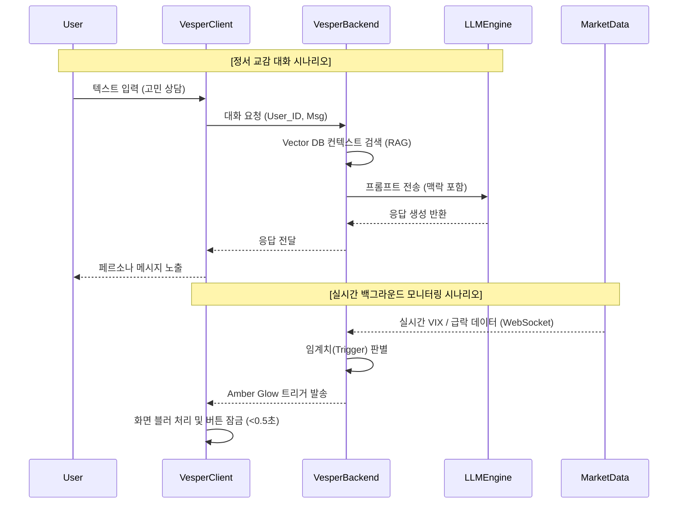
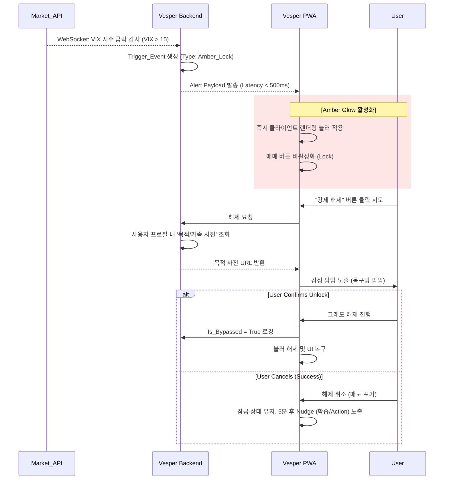
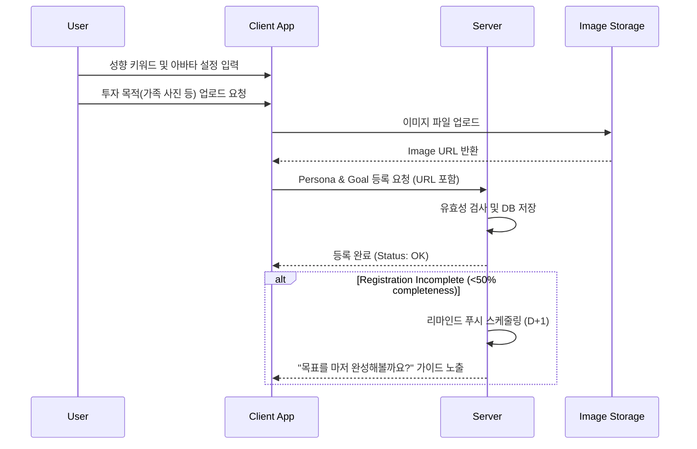
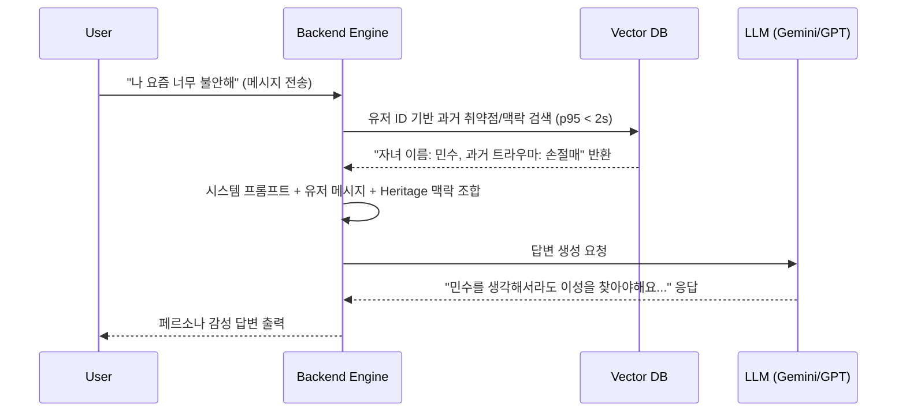
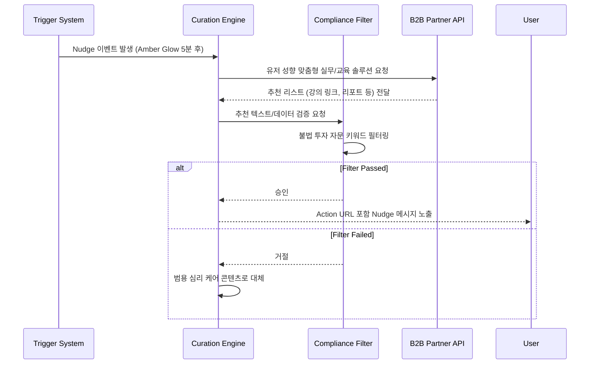

# Software Requirements Specification (SRS)
Document ID: SRS-001
Revision: 1.1
Date: 2026-04-15
Standard: ISO/IEC/IEEE 29148:2018

-------------------------------------------------
## 1. Introduction

### 1.1 Purpose
본 Software Requirements Specification(SRS) 문서는 투자 및 성장의 여정에서 사용자가 겪는 고독과 불안감을 해소하고 실질적인 목표 달성을 지원하는 Action-Master AI Companion OS 'Vesper'의 요구사항을 정의한다. 본 시스템은 일상적인 정서 교감(Lock-in)과 위기 상황에서의 초밀착 통제(Protection)를 통해 사용자의 뇌동매매를 방지하고 최적의 행동 지침을 제공하는 것을 목적으로 한다.

### 1.2 Scope
#### 1.2.1 In-Scope
- 모바일 환경에 최적화된 하이브리드 앱(PWA) 클라이언트
- SMS 및 카카오톡 백그라운드 메시징 인프라 연동을 통한 옴니채널 모듈
- 실존/가상 인물 기반의 무한 페르소나 생성 빌더 UI 및 RAG 기반 대화 엔진
- 외부 지표(VIX 등) 연동을 통한 실시간 모바일 화면 제어 (Amber Glow 블러링/매매 잠금)
- 투자 목적 리마인드 팝업 및 사용자 맞춤형 B2B 큐레이션 링크 제공
- 사용자 대화 및 심리 상태의 벡터 DB 저장을 통한 Heritage 시스템

#### 1.2.2 Out-of-Scope
- 사용자 자산을 직접 운용하는 인하우스 펀드 기능
- API를 통한 자동 매수/매도 트레이딩 봇 기능
- 기관 판매용 비식별 투자 심리 데이터 분석 대시보드 (Phase 2로 연기)

### 1.3 Definitions, Acronyms, Abbreviations
- **Vesper:** 사용자의 투자 및 성장을 돕는 AI 기반 동반자 운영체제(OS).
- **JTBD (Jobs To Be Done):** 사용자가 특정 상황에서 해결하고자 하는 근본적인 과업.
- **Amber Glow:** 극도의 시장 변동성 발생 시 패닉 셀 방지를 위해 화면을 블러 처리하고 매매 버튼을 잠그는 엔진.
- **Heritage Log:** 사용자의 과거 대화, 취약점, 심리 상태를 벡터화하여 저장한 데이터베이스 로그.
- **Nudge:** 컴플라이언스를 준수하는 선에서 투자/학습 목표 실현을 이끄는 실무 지침 및 B2B 큐레이션.
- **AOS (Adjusted Opportunity Score):** 사용자의 상황 및 시장 변동을 반영하여 재조정된 사용자 성장/투자 기회 지표.
- **DOS (Discovered Opportunity Score):** 시스템의 B2B 큐레이션 및 코칭을 통해 사용자가 새롭게 확보한 기회 평가 지표.
- **Validator (검증자):** 페르소나의 조언이 투자 자문 컴플라이언스 및 목표에 부합하는지 검증하는 내부 모듈 및 기준.

### 1.4 References
- **REF-01:** 05_PRD_Final.md (Vesper PRD v1.0, 2026-04-11)
- **REF-02:** 04_PRD_Quality_Inspection_Sheet_v2.md (감사 보고서)
- **REF-03:** 01_Value-proposition.md (선행 가치 제안 문서)

### 1.5 Constraints and Assumptions
#### 1.5.1 Constraints (제약사항)
- **컴플라이언스:** 자본시장법에 따라 직접적인 매매 지시 및 불법 자문은 자동 차단되어야 한다 (ADR-001).
- **과몰입 방지:** 페르소나 의존도 심화를 방지하기 위해 일일 대화량 임계치 초과 시 환기(Remind) 모드를 발동한다 (ADR-002).
- **비용 제한:** 건당 API 비용은 1.5원 미만, MAU 1만 명 기준 월 인프라 예산 한도는 450만 원이다 (ADR-003).
- **기술 의존성 보호:** 외부 VIX(시장) 데이터 수집 지연 및 실패에 대비해 WebSocket 연동을 우선하며, 장애 시 최근 1시간 이내 로컬 캐시를 활용한 Fallback 로직이 강제된다 (ADR-004).

#### 1.5.2 Assumptions (가정)
- **등록률:** 온보딩 시 가족 사진 또는 목표 등록률은 50% 이상일 것이다 (미달 시 리마인드 푸시 발송).
- **승인률:** 옴니채널 발송을 위한 기기 권한 승인률은 70% 이상일 것이다 (거부 시 Push 대체).

-------------------------------------------------
## 2. Stakeholders

| Role | Responsibility | Interest |
| :--- | :--- | :--- |
| **Core User (Q2)** | 직장인 및 가장. 정서적 지지 기반의 안정적 성장 추구. | 심리적 위안, 장기적 투자/학습 목표 달성 보조 |
| **Adjacent User** | N잡러 및 준전문가. 실질적 안목 서포트 및 능동적 코칭 요구. | 진화된 AI 지능을 통한 학습 및 커리어 패스 리딩 |
| **Extreme User** | 과거 패닉 셀 트라우마 보유. 높은 빈도의 투자 활동 수행. | 위기 상황 시 강력한 매매 통제, 뇌동매매 차단 |

-------------------------------------------------
## 3. System Context and Interfaces

### 3.1 External Systems
- **LLM Provider (OpenAI/Gemini):** 대화형 텍스트 생성 및 RAG 처리를 위한 엔진.
- **Market Data Provider:** 실시간 주가, VIX 지수 및 포트폴리오 비중 조회 API.
- **Messaging Vendor:** SMS 및 알림톡 등 앱 외부 채널 메시지 전송 (NHN Cloud/Twilio).
- **Vector Database (Pinecone/Weaviate):** Heritage 데이터 임베딩 및 검색 수행.

### 3.2 Client Applications
- **Vesper PWA Client:** iOS/Android 하이브리드 앱. UI 렌더링, 로컬 캐시, Amber Glow 제어 수행.

### 3.3 API Overview

| API Name | Type | Purpose | Provider/Target |
| :--- | :--- | :--- | :--- |
| **LLM_Chat_API** | REST/gRPC | 텍스트 프롬프트 질의 및 응답 수신 | External LLM Provider |
| **Market_Stream_API** | WebSocket | 실시간 VIX 및 Ticker 자산 가격 스트리밍 | Market Data Provider |
| **Omni_Message_API** | REST | SMS 및 알림톡 페이로드 전송 | Messaging Vendor |
| **Vector_Search_API** | REST | Heritage Log 기반 컨텍스트 검색(RAG) | Vector Database |

### 3.4 Interaction Sequences (Conversation & Amber Glow)

-------------------------------------------------
## 4. Specific Requirements

### 4.1 Functional Requirements

| ID | Source | Description | Acceptance Criteria (Given/When/Then) | Priority |
| :--- | :--- | :--- | :--- | :--- |
| **REQ-FUNC-001** | JTBD 1 | 페르소나 빌더 제공 | Given 온보딩 진입 / When 아바타 및 설정 입력 후 저장 / Then 즉시 페르소나 생성 및 대화 가능 | Must |
| **REQ-FUNC-002** | JTBD 1 | 옴니채널 외부 메시징 | Given 심리 위험 감지 / When 앱 미접속 상태 / Then 외부 채널(SMS/톡)로 선제 안부 메시지 발송 | Must |
| **REQ-FUNC-003** | JTBD 2 | 실시간 변동성 감지 | Given WebSocket 연결 / When VIX/하락장 수치 임계치 도달 / Then 즉시 서버에서 위기 시그널 이벤트 발생 | Must |
| **REQ-FUNC-004** | JTBD 2 | 클라이언트 Amber Glow 활성화 | Given 위기 시그널 수신 / When 앱 활성 상태 / Then 클라이언트 단독 UI 비활성화 및 블러 적용 | Must |
| **REQ-FUNC-005** | JTBD 2 | 투자 목적 리마인드 팝업 | Given 매매 버튼 잠금 상태 / When 유저가 강제 해제 클릭 / Then 등록된 목적 이미지와 감성 텍스트 즉시 렌더링 | Must |
| **REQ-FUNC-006** | JTBD 2 | B2B 큐레이션 Nudge & 컴플라이언스 | Given Amber Glow 발동 5분 경과 / When 컴플라이언스 필터 통과 / Then 맞춤형 실무 Action URL 포함 메시지 노출 (법적 리스크 차단) | Must |
| **REQ-FUNC-007** | JTBD 1 | Heritage 연관 데이터 저장 | Given 대화 종료 또는 이벤트 발생 / When 백그라운드 프로세스 실행 / Then 텍스트 임베딩하여 Vector DB 저장 | Should |
| **REQ-FUNC-008** | JTBD 1 | RAG 기반 맞춤형 답변 | Given 유저 질문 / When 프롬프트 조립 과정 / Then 관련 Heritage 데이터 검색하여 프롬프트 주입 | Should |
| **REQ-FUNC-009** | JTBD 1 | 시계열 감정 트래커 | Given 주 단위 정산 시점 / When 감정 Tracker 모듈 실행 / Then 주간 감정 점수 계산하여 차트 형태로 렌더링 | Could |
| **REQ-FUNC-010** | JTBD 1 | LLM 장애용 Fallback | Given LLM 응답 지연 > 2초 / When 답변 생성 실패 간주 / Then 백업 템플릿(3종) 중 하나 즉시 발송 및 중복 제어 | Must |
| **REQ-FUNC-011** | JTBD 2 | 데이터 API 장애 캐시 동작 | Given Market API 연결 실패 / When 변동성 검사 필요 / Then 최근 1시간 로컬 캐시 조회, 만료 시 경고 팝업 노출 | Should |
| **REQ-FUNC-012** | JTBD 1 | 채널 권한 거부 시 Push 대체 | Given 외부 채널 권한 거부 상태 / When 선톡 이벤트 트리거 / Then Push Notification API를 통해 메시지 전송 | Must |
| **REQ-FUNC-013** | VP 5.1 | Freemium 결제 장벽 (Paywall) | Given 유저가 Free 버전을 사용 중일 때 / When Amber Glow(1회 한도) 초과 트리거 시 / Then 보호 로직 중단 및 Vesper Prime(유료) 전환 모달 렌더링 | Must |

### 4.2 Non-Functional Requirements

| ID | Category | Description / Metric | Priority |
| :--- | :--- | :--- | :--- |
| **REQ-NF-001** | Performance | 백엔드 메시지 발송 및 응답 처리 시간: **p95 기준 500ms 이내** | Must |
| **REQ-NF-002** | Performance | Amber Glow 발동을 위한 데이터 스트리밍 지연: **최대 1초 이내** | Must |
| **REQ-NF-003** | Performance | 메시지 수신 후 실제 발송 채널망 인입 지연: **p95 기준 1.5초 이내** | Must |
| **REQ-NF-004** | Availability | 시스템 월 가용성(SLA): **99.9% 이상** (월 다운타임 43분 이하) | Must |
| **REQ-NF-005** | Reliability | 외부 채널 발송 트래픽 3배 스파이크 시 메시지 발송 실패율 **< 0.5%** | Should |
| **REQ-NF-006** | Reliability | API 실패(HTTP 500 등) 허용 오류율: **0.05% 이하** (5,000건당 1건 미만) | Must |
| **REQ-NF-007** | Reliability | LLM 장애 전파 방지: Fallback 발동 속도 **< 0.5초**, Vector DB 타임아웃 **2초** | Must |
| **REQ-NF-008** | Security | 모든 민감 정보 저장 시 **AES-256 암호화** 및 AWS KMS 연동 필수 | Must |
| **REQ-NF-009** | Security | **OAuth 2.0**(카카오/구글) 인증. JWT Access 30분, Refresh 14일 설정 | Must |
| **REQ-NF-010** | Security | 데이터 접근 제어: **Row-Level Security(RLS)** 적용 (본인 데이터만 접근) | Must |
| **REQ-NF-011** | Cost | 백엔드 단위 API 처리 비용(프롬프트 캐싱 등 활용): **건당 1.5원 미만** | Must |
| **REQ-NF-012** | Cost | MAU 10,000명 기준 월간 인프라 예산 한도: **450만 원** (초과 시 Slack 알림) | Must |
| **REQ-NF-013** | Monitoring | P95 지연 속도 > 800ms(3분 지속) 또는 SMS 실패 > 10회/분 시 Slack 경보 | Must |
| **REQ-NF-014** | Biz KPI | 런칭 90일 내 **페르소나 동반 성장률 40% 이상** 달성 | P0 |
| **REQ-NF-015** | Biz KPI | 런칭 90일 내 **일일 고객 시간 점유율 평균 15분 이상** 달성 | P0 |
| **REQ-NF-016** | Biz KPI | Amber Glow 개입 시 **패닉 셀 전환 비율(매매 해제율) 30% 이하** 억제 | P0 |
| **REQ-NF-017** | Biz KPI | B2B Curation **클릭-투-액션 전환율 15% 이상** 달성 | P1 |
| **REQ-NF-018** | Biz KPI | Vector DB 컨텍스트 리콜 적중률(**RAG Recall Hit Rate) 95% 이상** | P1 |
| **REQ-NF-019** | Biz KPI | AOS(Adjusted Opportunity Score) 개선율 **25% 이상** 달성 | P2 |
| **REQ-NF-020** | Biz KPI | 사용자 만족도(NPS) 긍정 응답 비율 **80% 이상** 보장 | P2 |

-------------------------------------------------
## 5. Traceability Matrix

| Requirement ID | Source User Story (JTBD) | Associated Features | Test Case ID (Draft) |
| :--- | :--- | :--- | :--- |
| **REQ-FUNC-001** | JTBD 1: 반려자 획득 (일상) | F1: 무한 페르소나 빌더 | TC-F001-01 |
| **REQ-FUNC-002** | JTBD 1: 반려자 획득 (일상) | F1: 옴니채널 모듈, 선톡 발송 | TC-F002-01 |
| **REQ-FUNC-003** | JTBD 2: 실무 성과 (목표) | F2: 실시간 VIX/가격 트리거 수신 | TC-F003-01 |
| **REQ-FUNC-004** | JTBD 2: 실무 성과 (목표) | F2: Amber Glow 물리적 화면 제어 | TC-F004-01 |
| **REQ-FUNC-005** | JTBD 2: 실무 성과 (목표) | F3: 투자 목적 감성 팝업 노출 | TC-F005-01 |
| **REQ-FUNC-006** | JTBD 2: 실무 성과 (목표) | F4: Nudge & 컴플라이언스 필터 | TC-F006-01 |
| **REQ-FUNC-007** | JTBD 1: 반려자 획득 (일상) | F5: Heritage 벡터 데이터 저장 | TC-F007-01 |
| **REQ-FUNC-008** | JTBD 1: 반려자 획득 (일상) | F5: RAG 기반 컨텍스트 인입 대화 | TC-F008-01 |
| **REQ-FUNC-009** | JTBD 1: 반려자 획득 (일상) | F6: 시계열 Emotional Tracker | TC-F009-01 |
| **REQ-FUNC-010** | JTBD 1: 반려자 획득 (일상) | F1: LLM 장애 백업 Fallback 모듈 | TC-F010-01 |
| **REQ-FUNC-011** | JTBD 2: 실무 성과 (목표) | F2: Market API 캐시 Fallback | TC-F011-01 |
| **REQ-FUNC-012** | JTBD 1: 반려자 획득 (일상) | F1: 옴니채널 거부 시 Push 대체 | TC-F012-01 |
| **REQ-FUNC-013** | VP 5.1: 비즈니스 해자 구축 | F7: 결제 Paywall & 사용량 Quota 통제 | TC-F013-01 |
| **REQ-NF-001~003** | 성능 기준 가이드라인 | 전체: 옴니채널 성능 및 스트리밍 지연 통제 | TC-PERF-001 |
| **REQ-NF-004~007** | 신뢰성 및 가용성 기준 | 전체: SLA 보장 및 API 에러 제어/Fallback | TC-REL-004 |
| **REQ-NF-008~010** | 보안 및 접근 제어 | 전체: 암호화 통신 및 내부 RLS 접근/권한 통제 | TC-SEC-008 |
| **REQ-NF-014~016** | KPI 북극성 지표 | 목표: 점유 시간, 동반 성장률, 패닉 셀 방어율 | TC-KPI-014 |
| **REQ-NF-017~020** | KPI 보조 지표/수익성 | 목표: AOS/DOS, RAG 적중률, NPS 80% 달성 | TC-KPI-017 |

-------------------------------------------------
## 6. Appendix

### 6.1 API Endpoint List

| Endpoint Path | Method | Purpose | Rate Limit (Expected) |
| :--- | :--- | :--- | :--- |
| `/api/v1/chat/message` | POST | 페르소나 대화 전송 및 수신 | 60 req/min per user |
| `/api/v1/market/stream` | GET(WS) | 실시간 마켓 지표 웹소켓 연결 | 1 connection per user |
| `/api/v1/trigger/amber-glow` | GET | 클라이언트 수동/동기화 트리거 확인 | - |
| `/api/v1/heritage/log` | POST | 사용자의 감정 및 컨텍스트 로깅 | 120 req/hour per user |
| `/api/v1/nudge/curation` | GET | B2B 제휴 액션 링크 및 지침 호출 | - |

### 6.2 Entity & Data Model

| Entity Name | Attribute (Field) | Data Type | Constraint | Description |
| :--- | :--- | :--- | :--- | :--- |
| **USER** | User_ID | UUID | Primary Key | 사용자 고유 식별자 |
| | Onboarding_Status | Boolean | Default: False | 온보딩 완료 여부 |
| | Auth_Token | String | - | JWT Access Token |
| | Subscription_Tier | Enum | Free, Prime | 유료 구독 여부 (기본 Free) |
| | Daily_Amber_Count | Integer | Default: 0 | 일일 Amber Glow 방어 발동 횟수 |
| **PERSONA** | Persona_ID | UUID | Primary Key | 페르소나 식별자 |
| | User_ID | UUID | Foreign Key | 소유자 ID |
| | Name | String | Max: 50 | 페르소나 이름 |
| | Tone_Manner | String | - | 대화 어조 프롭프 설정값 |
| | Avatar | String | URL | 이미지 경로 |
| **USER_GOAL** | Goal_ID | UUID | Primary Key | 목표/꿈 고유 식별자 |
| | User_ID | UUID | Foreign Key | 목표 소유 유저 ID |
| | Target_Text | String | - | 사용자의 장기 투자/성장 목표 |
| | Image_URL | URL | - | 매매 잠금 시 노출할 감성 이미지(가족사진 등) |
| **HERITAGE_LOG** | Vector_ID | String | Primary Key | 임베딩 벡터 식별자 |
| | User_ID | UUID | Foreign Key | 생성자 ID |
| | Memory_Type | Enum | chat, emotion | 기억의 종류 |
| | Content | Text | - | 텍스트 원문 |
| | Created_At | Timestamp | - | 생성 시각 |
| **TRIGGER_EVENT** | Event_ID | UUID | Primary Key | 발동 이벤트 식별자 |
| | User_ID | UUID | Foreign Key | 대상 사용자 |
| | Type | Enum | Amber_Lock, Nudge, Fallback | 이벤트 타입 |
| | Is_Bypassed | Boolean | Default: False | 잠금 강제 해제 여부 |
| | Triggered_At | Timestamp | - | 이벤트 발생 시각 |
| **EXTERNAL_MARKET** | Ticker | String | Primary Key | 종목/지수 코드 (예: ^VIX) |
| | VIX | Float | - | 변동성 지수 |
| | Current_Price | Float | - | 실시간 가격 |
| | Updated_At | Timestamp | - | 갱신 시각 (캐시 식별용) |

### 6.3 상세 상호작용 모델 (Detailed Interaction Models)

#### [모델 1] 실시간 Amber Glow 대응 및 감성 방어

#### [모델 2] 온보딩 및 페르소나/목표 설정 Flow

#### [모델 3] Heritage 기반 RAG 대화 생성 Flow

#### [모델 4] B2B 콘텐츠 큐레이션 및 컴플라이언스 필터

